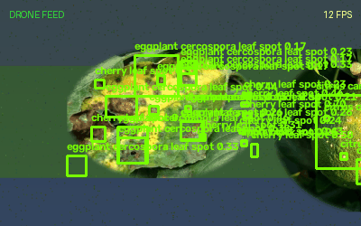
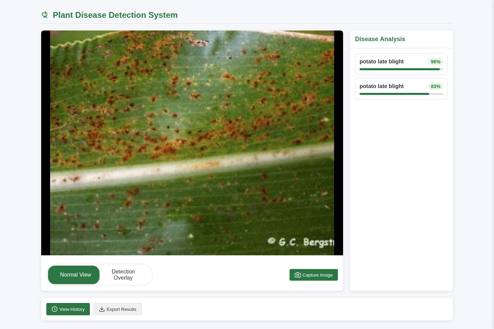

<div align="center">

# 🌱 DLCNN-PlantSegmentation

**Real-time plant disease detection from webcam or DJI Tello drone feeds, built
on YOLOv8 and served through a Django dashboard.**


[](LICENSE)

</div>

A deep-learning computer-vision system that detects **115 plant disease
classes** in live video. The Django app streams the annotated feed from a
webcam or a **DJI Tello drone**, shows per-frame disease analysis, and lets you
capture and export results — with the model trained end-to-end on the
**PlantSeg** in-the-wild dataset.





---

## Features

- **Live YOLOv8 detection** — 115 disease classes on webcam or Tello drone
  streams (MJPEG video + SSE analysis in parallel)
- **Real-time on CPU** — ~26 FPS single-forward-pass inference at `imgsz=416`
  on a mid-range laptop (see [benchmark](scripts/benchmark.py))
- **Frame-skip pipeline** — inference every Nth frame with persistent overlay,
  so the feed stays smooth on modest hardware
- **Capture & export** — one-click frame capture with annotations, history view,
  and ZIP export
- **Trained on real in-the-wild data** — PlantSeg (11,400+ images, 115 classes),
  with label cleaning (out-of-bounds boxes clamped)
- **Drop-in weights** — place your trained `best.pt` and the app uses it
  automatically (graceful fallback to a pretrained YOLO otherwise)

## Tech stack

| Layer | Tools |
|---|---|
| Deep learning | Ultralytics **YOLOv8**, PyTorch, OpenCV |
| Web app | **Django** 4.2+, gunicorn, WhiteNoise, SSE, MJPEG streaming |
| Database | **SQLite** (Django ORM — capture history persistence) |
| Drone | **djitellopy** (DJI Tello API) |
| Experiment tracking | **MLflow** (params, metrics, artifacts) |
| Deploy / run | **Docker**, docker compose, Render (free tier) |
| Training | Jupyter notebook, CUDA (CETUS HPC / SageMaker) |

## Repository structure

```
├── PlantDiseaseAPP/
│   ├── manage.py                    # Django entry point
│   ├── plant_disease_detection/     # Django project config (settings, urls)
│   ├── plant_disease/               # Django app: views, routes, templates, static
│   │   ├── views.py                 # YOLO inference, video/analysis streaming, captures
│   │   ├── templates/plant_disease/ # Web dashboard
│   │   └── static/captures/         # Captured/analysed images (runtime)
│   ├── scripts/drone/               # Standalone drone control + demo scripts
│   └── training_plantseg.ipynb      # Training notebook (YOLOv8 + Faster R-CNN baseline)
├── scripts/
│   ├── download_weights.py          # Fetch the trained 115-class weights
│   └── benchmark.py                 # Reproduce the inference FPS table
├── Dockerfile                       # Container image for the dashboard
├── docker-compose.yml               # One-command local startup
├── render.yaml                      # Free-tier Render (cloud) deployment
├── Procfile                         # gunicorn entry point (PaaS compatible)
├── .dockerignore
├── docs/
│   ├── PROJECT_REPORT.md            # Full project write-up
│   ├── demo_drone_scan.gif          # Simulated drone flyover demo
│   ├── dashboard.png                # Live dashboard screenshot
│   └── demo_images/                 # Sample images for demo mode (no hardware)
├── requirements.txt                 # Web app dependencies
├── requirements-training.txt        # Notebook/training dependencies
└── LICENSE
```

## Quick start

```bash
python -m venv .venv
source .venv/bin/activate          # Windows: .venv\Scripts\activate
pip install -r requirements.txt
python scripts/download_weights.py # optional: fetch the trained 115-class model
cd PlantDiseaseAPP
python manage.py migrate
python manage.py runserver
```

Open http://localhost:8000 — the dashboard shows the live camera feed,
detection overlay, per-frame disease analysis, capture history, and ZIP export.

### Endpoints

| URL               | Description                                     |
|-------------------|-------------------------------------------------|
| `/`               | Dashboard                                       |
| `/video_feed/`    | MJPEG stream (`?source=webcam` or `drone`, `?overlay=true`) |
| `/analysis_feed/` | SSE disease analysis stream                     |
| `/capture/`       | Capture + analyse the current frame (`?source=` matches the feed) |
| `/history/`       | JSON capture history                            |
| `/export/`        | Download all captures as a ZIP                  |
| `/admin/`         | Django admin                                    |

> Dev-only note: `/capture/` writes an annotated image and a row to the SQLite
> database on a plain GET with no auth — fine for local demos, not for anything
> public. Capture history is persisted in the DB (see
> `plant_disease/models.py`), so it survives app restarts.

## Run with Docker

The repo ships a ready-to-build container that runs the dashboard in **demo
mode** (streams the bundled sample images — no camera or drone needed):

```bash
docker compose up --build          # or: docker build -t plantseg-dashboard . && docker run -p 8000:8000 plantseg-dashboard
```

Open http://localhost:8000. Captures are persisted in a named volume
(`captures`). Set `DEMO_IMAGES_DIR` to a folder of your own images in
`docker-compose.yml` to demo different scenes.

## Deploy to a free cloud tier (Render)

A [Render Blueprint](render.yaml) is included for free-tier deployment:

1. Push this repository to GitHub.
2. On Render: **New → Blueprint** → select this repo → **Create Resources**.
3. Open the generated `https://<service>.onrender.com` URL.

The blueprint runs `migrate` + `collectstatic` at build time, serves the app
with gunicorn, and defaults to demo mode. Set `DEMO_IMAGES_DIR` if you want
different demo images. (Render's free tier uses an ephemeral filesystem, so
captured images do not persist across restarts there.)

## Experiment tracking with MLflow

The [training notebook](PlantDiseaseAPP/training_plantseg.ipynb) logs every
run — hyper-parameters, validation metrics (mAP50, mAP50-95, precision,
recall) and the trained weights — to **MLflow**:

```bash
pip install -r requirements-training.txt
# in the notebook: run top to bottom; the MLflow cells auto-log the run
mlflow ui --backend-store-uri file:./mlruns   # browse runs at http://localhost:5000
```

Set `MLFLOW_TRACKING_URI` to point at a remote tracking server
(e.g. `http://localhost:5000`) to centralise experiments across machines.

## Model performance

The production model is a **YOLOv8s** trained at `imgsz=640` on PlantSeg
(115 classes) with cleaned labels. Trained on a UTS CETUS RTX PRO 6000
Blackwell GPU; best at epoch 77 (early-stopped at 95).

| Metric | Value |
|---|---|
| **mAP50** | **0.315** |
| **mAP50-95** | **0.191** |
| Precision / Recall | 0.393 / 0.357 |
| Val set | 1,247 images / 8,926 instances |

Single-forward-pass inference throughput (CPU benchmark, trained model,
115 classes; reproduce with [`scripts/benchmark.py`](scripts/benchmark.py)):

| imgsz | Latency | FPS |
|---|---|---|
| 416 | 38 ms | **26 FPS** |
| 512 | 52 ms | **19 FPS** |
| 640 | 84 ms | **12 FPS** |

Note: this measures a single model forward pass. The live feed additionally
does frame encoding and a frame-skip overlay, so detection *updates* land at a
lower rate (e.g. ~8.7 Hz at `FRAME_SKIP=3`) — still smooth because the overlay
persists between inference frames.

See [docs/PROJECT_REPORT.md](docs/PROJECT_REPORT.md) for the full training
history, dataset details, and design trade-offs.

## Model weights

The app loads `PlantDiseaseAPP/plant_disease/best.pt` for detection. If the
file is missing it automatically falls back to a pretrained `yolov8n.pt` model
(80 COCO classes) so the app runs out of the box — but for the **full 115
plant-disease classes** you need the trained weights.

Download them from the [releases page](https://github.com/MathgeniusTB2/DLCNN-PlantSegmentation/releases)
with the helper script:

```bash
python scripts/download_weights.py                 # latest release
python scripts/download_weights.py --version v1.0  # specific tag
```

or drop your own trained weights at that path — the app picks them up
automatically. Note: the COCO-fallback model labels will be nonsense for plant
diseases (it detects generic objects), so always fetch `best.pt` for real
detection.

### Live-feed tuning

| Env var           | Default | Meaning                                           |
|-------------------|---------|---------------------------------------------------|
| `MODEL_SIZE`      | `n`     | Fallback model size (`n/s/m/l/x`) when `best.pt` is absent |
| `MODEL_IMGSZ`     | `416`   | Inference input resolution                        |
| `MODEL_FRAME_SKIP`| `3`     | Run inference every Nth frame; overlay persists between |
| `DEMO_IMAGES_DIR` | *(empty)* | Folder of jpg/png images to stream instead of a webcam/drone — runs the full dashboard with no hardware |

```bash
MODEL_SIZE=s MODEL_IMGSZ=512 MODEL_FRAME_SKIP=2 python manage.py runserver
```

### Demo mode (no hardware)

Set `DEMO_IMAGES_DIR` to a folder of images to stream the dashboard from
static photos instead of a webcam or drone — real inference still runs on each
frame, so the whole UI works with no hardware:

```bash
DEMO_IMAGES_DIR=/path/to/images python manage.py runserver
```

The repo ships six sample frames in `docs/demo_images/`, so demo mode works
out of the box on a fresh clone (attribution in `docs/demo_images/README.md`).
The dashboard screenshot above was captured this way.

## Drone (DJI Tello)

The dashboard streams from a Tello via `?source=drone`. Standalone scripts:

```bash
python PlantDiseaseAPP/scripts/drone/drone_control.py          # keyboard-controlled flight + live feed
python PlantDiseaseAPP/scripts/drone/plant_detection_demo.py   # webcam inference demo using best.pt
```

Controls (`drone_control.py`): `W/S/A/D` move · space up · `X` down · Enter
takeoff · `O/P` rotate · `Q` quit.

## Training the model

The notebook [`training_plantseg.ipynb`](PlantDiseaseAPP/training_plantseg.ipynb)
trains a YOLOv8 detector (size configurable via `MODEL_SIZE`) on the PlantSeg
dataset, with an optional Faster R-CNN baseline in the appendix. It runs top
to bottom: COCO → YOLO label conversion (out-of-bounds boxes clamped) → train
→ evaluate → sample inference → copies `best.pt` into the web app.

```bash
pip install -r requirements-training.txt
# run training_plantseg.ipynb top to bottom
# the final cell copies best.pt to PlantDiseaseAPP/plant_disease/best.pt
```

The dataset is **not** committed; place it at `PlantDiseaseAPP/plantsegv3/`:

```
plantsegv3/
├── images/
│   ├── train/
│   ├── val/
│   └── test/
└── masks/
    └── annotation_{train,val,test}.json
```

### Dataset

Trained on **PlantSeg: A Large-Scale In-the-wild Dataset for Plant Disease
Segmentation** — 11,400+ images of 115 plant diseases with instance-level
annotations.

- Paper: https://arxiv.org/abs/2409.04038
- Download (Zenodo): https://zenodo.org/records/14935094
- Project: https://github.com/tqwei05/PlantSeg

> Wei, T., Chen, Z., Yu, X., Chapman, S., Melloy, P., Huang, Z. "PlantSeg: A
> Large-Scale In-the-wild Dataset for Plant Disease Segmentation." arXiv
> preprint arXiv:2409.04038, 2024.

## License

Released under the [MIT License](LICENSE). The PlantSeg dataset is separately
licensed by its authors.
